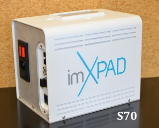

Xpad
-------



Intoduction
```````````
The XPAD detector is based on the photon counting technology providing a quasi noiseless imaging as well as a very high dynamic range and a fast frame rate (500 images/s).
This is a detector from the collaboration of Soleil, CPPM and ESRF(D2AM). It is now supported by the ImXPAD company.

The XPAD run under Linux, with the help of a PCI express board from PLDA.


Module configuration
````````````````````
There is no specific module configuration, as the host is provided by the manufacturer

